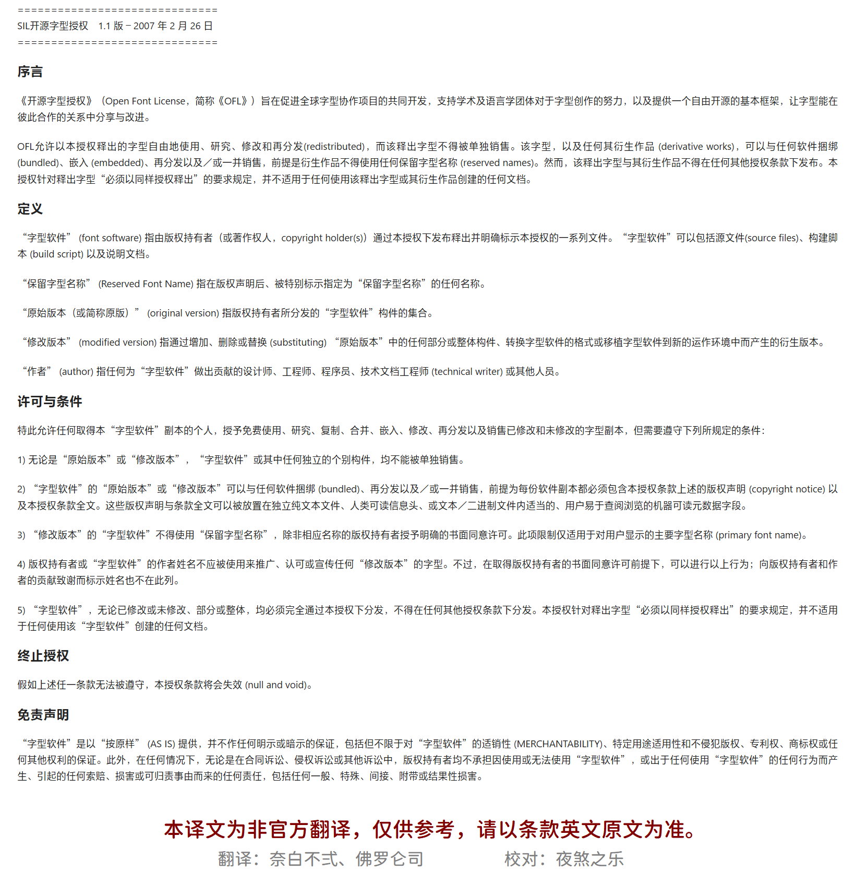
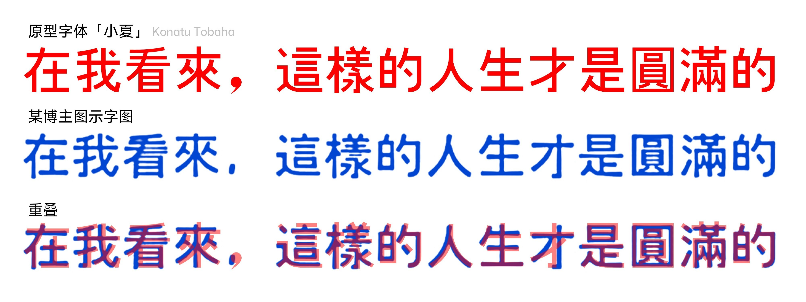

:::NOTE[转载须知]  
本篇文章已在多处社交平台发表，欢迎四处转载，转载需标注原作者。
:::

如果，开源字体遭到打包倒卖却被视为理所当然，可以明目张胆改头换面、据为己有，乃至成为 AI 技术的祭品，却被声称「原创造字」，那么还会有多少人坚持「开源精神」？

从几年前开源字体遭到倒卖[↗\[1\]](https://github.com/lxgw/lxgw/blob/main/documents/hall_of_shame.md)，到近期某博主以开源字体为原材料，使用 AI 技术生成字形却自称「原创造字」[↗\[2\]](https://mp.weixin.qq.com/s/BhgleVjEyhqEnict1OCOzA)，再到＠霞鹜lxgw 遭第三方改作肆意「碰瓷」[↗\[3\]](https://www.bilibili.com/opus/1216899818532634627)，国内开源字体生态的乱象已让无数设计师寒心。有人因为开源和免费商用而受益，但某些人却对开源似乎产生了一种致命的幻觉：「开源」二字，就是可以肆意妄为的「免死金牌」。

作为一名同样受益于开源共享的开源字体爱好者，见证这一切的发生，我愤懑难平、不吐不快。

在此，我以开源字体爱好者之名，向那些罔顾开源规则的人发出警告：**开源不是你们为所欲为的免死金牌，从来都不是。**

# 开源为何而存在

何谓开源？开源即是以开放源代码的形式，让一款产品（包括程序、字体等）能够在彼此合作的关系中使用、分享与改进。不论开源的是什么，开源的核心不仅仅是产品本身，还有与之相伴的「许可证」。它是一种法律契约，是字体设计师将自己的智力成果（包括经过数千小时打磨的曲线、字距、Hinting 微调等）以某种条件分享给世界的声明。

开源字体，多数以其免费商用的特点，惠及和造福了相当一部分设计师和普通使用者。多数使用者在面对堪比天价的授权费用时，舍不得付费购买字体，相比之下，开源字体因其使用成本低、法律风险小等特点，一度成为了许多个人使用者的首选。

某站点显示，一款字体的商业授权费用价格不菲

此外，部分字体厂商屡次向一些没有使用他们家字体的个体户发出律师函，也导致了人们普遍对部分厂商产生了「讼棍」「版权蟑螂」的印象。比如某字体厂商凭借个别字形特点相似等理由，指控使用免费商用字体的用户（原文见[↗ 买胡晓波字体还被告侵权？](https://mp.weixin.qq.com/s/0Dmpsd6LU5wXtz6zBuoiqw)）。至此，愿意使用商业授权字体的用户越来越少，除了部分特殊要求之外，多数用户早已从商用授权型字体，转向开源字体这一类法律风险相对较小的字体。

常见的开源字体许可证，比如 SIL 开放字体许可证（OFL）或 Apache 许可证，各有各的规则。以使用最广泛的 OFL 为例，它的核心精神是：你可以自由使用、修改、甚至再分发这款字体，但你不能单独销售这款字体本身，并且任何修改版必须沿用同样的许可证发布。这本应是一场「善意的接力」。我接过你的火种照亮前路，也承诺将火种以同样方式传递下去，而不是把它装进自己的灯笼里，然后挂上「独家原创」的招牌获利！

可惜的是，现在很多人对字体版权的理解，依旧停留在「我们大家的文字，什么时候要你收费了才能用」的程度，甚至一些干美工的，也是如此的双标心态。他们对开源协议的理解就是「君子协定」，觉得违约也无妨（毕竟迄今为止还没有一个用户因为违反开源协议而受到律师函警告的），以至于视之无物，认为「既然是开源，便是让我白用」。

# 开源从来不是为所欲为的借口

我算是发现了，在某些人眼里，开源协议那几页写满英文的`LICENSE`文件，根本不是什么法律契约，就是打包时附赠的一张厕纸。下载解压之后直接扔进回收站，反正「开源」两个大字摆在那儿，那不就等于可以为所欲为？

SIL OFL 1.1 协议里明明白白写着 **「『修改版本』的『字型软件』不得使用『保留字型名称』」**，在他们眼里那纯纯是作者的「单方面废话」。他们把设计师基于「自由传播」理念给予的信任，曲解为「价格为零」的施舍，然后大肆掠夺。这就像有人走进一家写着「免费品尝」的食品店，把整盘试吃品端走，还理直气壮地说：「你写的免费，我端回家当晚餐吃怎么了？」

SIL OFL 1.1 许可协议中文译本

你跟他讲契约精神，他跟你耍流氓；你跟他讲法律边界，他跟你扯「开源精神就是无私奉献」。合着作者熬了几百个通宵调出来的每一个锚点，在你这儿就是「无私奉献给你当垫脚石赚流量的」？这哪是开源共享，这是把别人的善意当成自己的提款机，把创作者的理想主义，当成你空手套白狼的慈善募捐箱。

每次被人戳穿冒名顶替的把戏，这些大师的统一话术永远是那一句「哎呀，我一个做设计的，哪看得懂这些复杂的法律文件啊？我真不知道不能这么用。」可是合着你改字体的时候，对着几百个汉字的笔画抠得比谁都细，轮到看三页许可证的时候，瞬间就变成了目不识丁的文盲？有些人啊，你们连商用授权的付费链接都能精准绕开，却在面对免费商用字体授权时看不懂「不得使用『保留字型名称』」这几个大白字？

按这个逻辑，我明天去博物馆拿个铲子挖文物，被抓了也能跟警察说「我不懂文物保护法，我以为地里的东西都是无主的」，是不是也能直接无罪释放？「无知者无罪」这五个字，在他们眼中就是「无知者无贼」，只要假装看不懂规则，就能光明正大把别人的成果揣进自己兜里，即使是一个再普通不过的外人都不得不发话了。

最搞笑的是这群人的双标现场：他们一边在网上痛骂「字体版权方都是黑心资本家，一套字体天价授权费简直是抢钱」，一边声明「版权归原字库所有，不可商用，严禁倒卖二传」，一边转头把开源作者免费分享的字体投入 AI 造字作为所需原材料，随后给生成轮廓犹如狗啃一般的字打上「原创造字」的标签，接商单的时候一款字敢收几十块。

某博主展示字图与「小夏字体」(Konatu) 字图对比

:spoiler[对的！没错！犬＊志，我™说的就是你！你自己不站出来认罪，我也当然没办法拿你怎么样。但迟早有一天，有良知的人越来越多，你就等着被谴责吧！]

合着别人花几年做字体就是「黑心牟利」，你偷别人的成果卖钱就是「独立创作实现价值」？别人的心血必须免费给你用，你用别人的心血赚的钱，就得全揣进自己口袋？

我真的特别好奇，这些号称「原创造字」的大师，要是哪天让你从画第一个点开始，不借助任何开源字体的基础，也不借助 AI 造字技术，自己磨出一套 6000 字以上的完整中文字体，你是不是得当场原地螺旋升天，直接成为世界字体设计史上的奇迹？

别再拿「开源精神」当你的遮羞布了，你在 GitHub 上的下载记录、你修改字体时没删干净的原作者信息、你发布时偷偷抹掉的开源协议，全都是明明白白的证据。你以为你用一些基础方法修改字体，就能借别人的热度让自己火一把，或能让别人几年的心血全变成自己的功劳，殊不知在真正的字体爱好者眼里，你那点小把戏，就像把别人的论文改了三个标点符号，就敢去评院士一样可笑。

只愿白食、不守规矩，甚至反过来巧取他人的心血为自家铺路——这从来不是所谓「商业智慧」，而是‌偷窃‌。

# 如果没有开源：覆巢之下，安有完卵

当下这群人正在毁灭「开源」精神，但是真的有人想过如果没有开源，将会发生什么吗？那些滥用开源字体的人，你们以为这失去的只是 AI「炼丹」的原材料，以及只是自己为了那可怜的、微不足道的、甚至是蹭热度出来的所谓「名誉」这么简单吗？！但对于每一个人而言，开源世界不复存在，后果远超预期。

没有了开源世界，就只剩下商业化的局面。在软件行业，对软件未来的版本和软件的升级的依赖，使得软件用户不能离开软件所有者，这将导致垄断的局面。如果在软件中发现问题时，软件所有者已经消失，或者他们决定停止或减少软件的生产或支持，都能让用户陷入不利和无助的境地。此外，由于业务问题，软件所有者可能无法改进或支持软件；或是软件的老版本的支持已经到期，却没有其它的软件供应商提供支持。

同样，对于字体社区而言，开源一旦不复存在，或许将没有更多的开发者愿意将自己的劳动成果，以开源的形式造福普罗大众，每一位个人使用者都将为了一份海报、一条视频，乃至一份文档中的字体支付不菲的费用。「版权蟑螂」和「讼棍」的印象并不会在人们心中消失，反而会因此进一步激化。那些使用开源字体却违背许可协议的人，别忘了你们也是普通使用者的一员，你们不仅正在伤害开源社区人们的感情，更关键的是，你们此举无异于作茧自缚。

**收起你们的傲慢与侥幸，重新翻开那份被你忽略的`LICENSE`文件，把属于别人的名字，还回去。** 如果你们做不到，那就请你们花钱去买商业字体授权。这个世界运行的规则很简单：想要免费、自由的公共资源，你就得尊重并遵守共享契约；若不愿受此约束，欢迎你转向成熟的商业授权字体市场，通过合法购买换取安心无忧的使用权。

但如果既不想使用商业字体，还想要利用开源字体为所欲为，那么你们靠践踏他人心血所堆砌的一切「成果」，都将在公众的审视下，成为你们数字坟场上最刺眼的墓志铭。

**开源不是法外之地，更不是你们为所欲为的免死金牌。** 这句话，我放在这儿，不服来辩。

如果你觉得被冒犯了，那说的就是你这种人。

# 附录 | 参考文献
1. [↗](https://github.com/lxgw/lxgw/blob/main/documents/hall_of_shame.md) 耻辱柱 / Hall of Shame by LXGW
2. [↗](https://mp.weixin.qq.com/s/BhgleVjEyhqEnict1OCOzA)「首款原创造字」独一无二｜:spoiler[拾陆旧黑beta] 预览版 100/90/80/70/60 
3. 声明 by LXGW [↗ B 站](https://www.bilibili.com/opus/1216899818532634627) | [↗ 微博](https://weibo.com/6624339726/R5poUq43u)
4. [↗](https://mp.weixin.qq.com/s/0Dmpsd6LU5wXtz6zBuoiqw) 买胡晓波字体还被告侵权？
