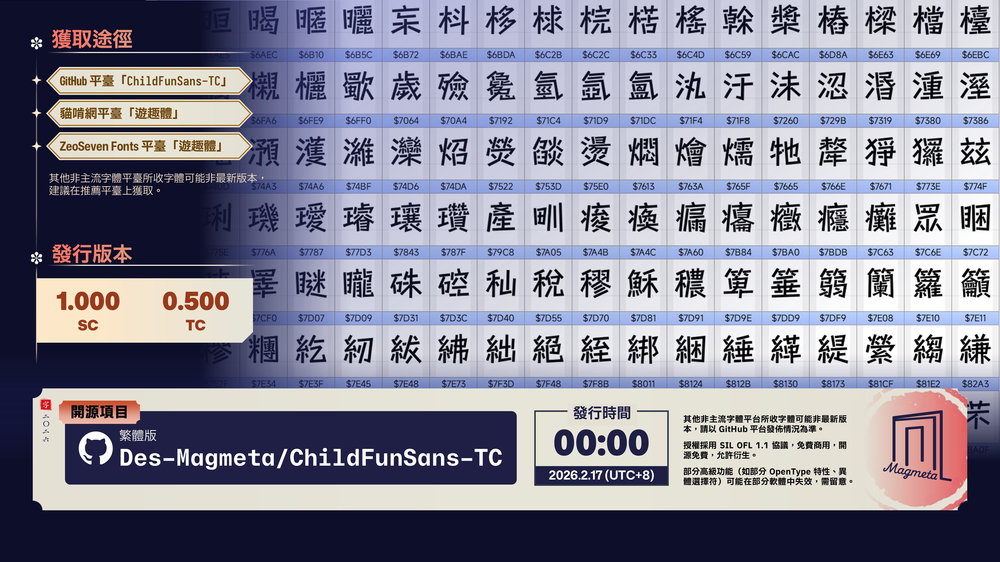

2026 年 2 月 17 日零时，在众人迎接新春到来之际，仲代骆驼在 GitHub 平台上发布了「游趣体」简体版 1.000 版本更新，同时迎来繁体版初次发行。

自 2024 年 8 月以来，本人修改衍生的字体逐渐在各个地方广泛使用。出现在实体店的设计中、视频封面里，甚至出现在了漫画当中。一直以来，作为字体开发者的本人尝试为这款字体制作一个宣传视频，可惜由于种种原因，迟迟没有完成。但如今，这部宣传视频——它来了。

# 新年首更，开源免费，风格活泼 | 「游趣体 / Child Fun Sans」

<iframe src="//player.bilibili.com/player.html?isOutside=true&aid=116081389737325&bvid=BV1p4Z3B2ECE&cid=36111190134&p=1" scrolling="no" border="0" frameborder="no" framespacing="0" allowfullscreen="true"></iframe>

2020 年 12 月，日本著名字体厂商 FONTWORKS（今 MonoType 株式会社）在 GitHub 上发布了 7 款日文字体，分别为 [<ruby>Train<rp>(</rp><rt>トレイン</rt><rp>)</rp></ruby>](https://github.com/fontworks-fonts/Train)、[Klee](https://github.com/fontworks-fonts/Klee)、[Stick](https://github.com/fontworks-fonts/Stick)、[RocknRoll](https://github.com/fontworks-fonts/RocknRoll)、[Reggae](https://github.com/fontworks-fonts/Reggae)、[<ruby>Rampart<rp>(</rp><rt>ランパート</rt><rp>)</rp></ruby>](https://github.com/fontworks-fonts/Rampart) 和 [<ruby>DotGothic<rp>(</rp><rt>ドットゴシック</rt><rp>)</rp></ruby>16](https://github.com/fontworks-fonts/DotGothic16)，根据 SIL Open Font License 1.1 授权许可开源。7 款开源日文字体各有各的特点，在 2024 年 7 月之前，已有其中 3 款拥有相应的简体中文改版字体：
- **<ruby>Klee<rp>(</rp><rt>クレー</rt><rp>)</rp></ruby> One** 被衍生成了众所周知的[「霞鹜文楷」](https://github.com/lxgw/LxgwWenKai)，得到广泛使用；
- **<ruby>RocknRoll<rp>(</rp><rt>ロックンロール</rt><rp>)</rp></ruby> One** 的衍生中文字体[「龙珠体」](https://github.com/maoken-fonts/LongZhuTi)也广泛见于海报、视频封面、字幕等地方，拥有不错反响。
- **<ruby>Reggae<rp>(</rp><rt>レゲエ</rt><rp>)</rp></ruby> One** 衍生成的[「铁蒺藜体」](https://github.com/Buernia/Tiejili)因支持漫画用标点等特性，为漫画嵌字领域提供了一种新的选择。

在剩下来没有相应衍生的中文字体中，除了 Stick，其余 3 款字体因均由同一款字体（目测是 Happy Rodin，商用需授权）变换而成，且支持字数有限，修改意义不大，鉴于此，2024 年起，本人开始了为 Stick 这一风格独特的日文开源字体补全中文常用字的尝试，并在同年 7 月发布第一版。

## 简体版重大更新

原始字体 <ruby>Stick<rp>(</rp><rt>ステッキ</rt><rp>)</rp></ruby> 是一种带有可爱调皮的气氛的字体，其造型像笔杆一样以直线设计。此外，由于它可以表达田园诗一般的气氛，它也是一种可广泛用于纸张媒体和数字内容的字体。「游趣体」基于它改造，也继承了原始字体的特点：笔形像笔杆一样以直线设计，既可爱调皮，亦有田园写意风格。本人基于 Fontworks 出品的日文字体 Stick 扩充、调整字形，并编辑、适当增加 OpenType 特性，以满足简体中文环境的使用需求。

在这一年多的时间里，字体迭代了多个版本，迄今为止这款字体已经不仅支持 [GB/T 2312](https://github.com/NightFurySL2001/cjktables/blob/master/china/encoding/gb_t_2312.txt) 标准所包含的字符，而且已经完美支持[《通用规范汉字表》](https://github.com/NightFurySL2001/cjktables/blob/master/china/standard/tongyong_guifan.txt)所包含的字符，足以满足日常使用和义务教育用途。尽管如此，在实际应用层面仍存在部分字符不能正常支持的现象，比如「挼」「冇」「𩉜(⿰革几，`U+2925C`)」等。所以，在参照了众多外字表后，我们选择性地增加了一些不在原定计划内，但实际很常用的外字，尽可能解决此类问题，这些字源自各个领域，包括语言、人文、常用地名等等。即使是笔画繁多，结构复杂的「𰻝(⿺辶⿳穴⿲月⿱⿲幺言幺⿲长马长刂心，`U+30EDD`，繁体`U+30EDE`)」字也考虑在内。

受限于文章篇幅，更新详情不在此尽数列出。如需了解，请前往源项目中的`Docs\Update.md`阅读完整内容。

需要注意的是，此版本将是最后一个包含简体子集的版本，换言之，后续更新基于且仅提供包含完整版文件，不再提供简体版文件（后缀为`-CHS`）。如需基于此字体进行二次衍生，且今后没有长期更新的打算，建议使用<ruby>此版本<rp>（</rp><rt>1.000 版</rt><rp>）</rp></ruby>的简体子集版进行修改。

各位用户可通过 GitHub 项目获取最新版本的字体：
::github{repo="Des-Magmeta/ChildFunSans"}

  

## 繁体版初次发行

简体范围的开发已经完成，但从长远来看，开发历程目前并没有结束。一年多以来，简体版正在补齐的发展历程中，另一边也有人开始了补字历程。尽管在补字过程中，有其他制作者发布了繁体版本，是以传承字形为主的。但本人制作繁体版的历程并不会因此停止。相较于传统正文与标题字，艺术字向来在构型方面更为宽容，因而笔形更为多样。观者对艺术字的多样笔形也更为接受。考虑到 Stick 的部分笔形具有一定手写感，「游趣体」繁体版计划发布现代字形版本，采用折中印刷字形，在传统字形基础上，兼顾当代惯用部件写法。

即将初次发行的繁体版，将支持台湾地区的《常用国字标准字体表》4808 个繁体常用汉字，<ruby>五大码<rp>（</rp><rt>Big 5</rt><rp>）</rp></ruby>一级字 5401 个，支持程度相当于简体版支持常用 3500 字。考虑使用繁体中文用户的使用习惯，繁体版全角标点（主要调整`，` `．` `、` `。`）居中，弯引号（“”）默认采用比例宽度①。

各位用户可通过 GitHub 项目获取本系列字体的繁体版：
::github{repo="Des-Magmeta/ChildFunSans-TC"}

 

> ①繁体中文环境下，通常用「直角引号」，“弯引号”仅用于西文中。

## 授权说明

每年字体侵权案例层出不穷，大家也开始有意识地去避免字体侵权。因此，近年来字体协议说明对每一位使用者而言不可或缺。「游趣体」继承了 Stick 所遵循的 [SIL Open Font License 1.1](https://openfontlicense.org/)（以下简称 OFL 1.1）开源协议，这套协议声明：使用此协议的字体「允许使用，包括商用」——无论个人企业，均可自由使用该字体，无需标明或知会原作者；同时可自由下载传播该字体，将该字体安装于任何设备，或嵌入于 APP 和网页中；此外，在 OFL 1.1 许可授权下，可在该字体基础上修改或制作衍生字体。

OFL 1.1 允许使用者修改和衍生「二创」字体，在衍生时仍需要遵循相关条款。OFL 1.1 规定，不可将该字体及其衍生字体在它本身之外的许可条款下发行。换言之，源自 OFL 1.1 字体的二创字体仍需遵循相同协议。同时根据 OFL 1.1 的规定，禁止将字体文件单独售卖获利。（尽管在现实中一部分软件中存在遵循这一协议的字体，以各种名义的费用和其他服务一同打包销售的情况，这似乎是在利用这一协议漏洞。毕竟，协议里只是禁止单独销售文件，但对捆绑销售行为只字未提。只能说，这终归是君子协议，防不了小人。）

简体版和繁体版已于 2 月 17 日零点（UTC+8）于 GitHub 发布，欢迎各位使用者前去使用！

最后，祝愿各位使用者们新春快乐，万事顺遂！
